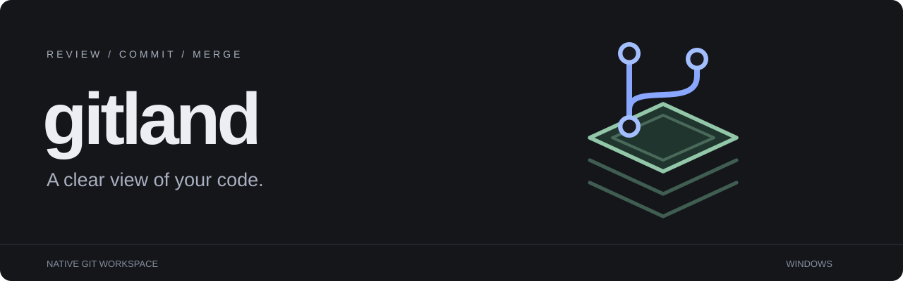

# Gitland

A native Git client for Windows, built around readable diffs, three-way review, and an editable merge result. Clockt’s **Xcode Dark** palette, configurable typography, and a resizable workspace keep your code at the center.

[**Download for Windows x64**](https://github.com/fezcode/gitland/releases/latest) · [Release notes](docs/releases/0.14.1.md) · [Workflow guide](docs/git-client.md)

## Get started

1. Download `Gitland-Setup-0.14.1.exe` from Releases and run it.
2. Run `gitland.exe`.
3. Choose **Open repository**, **Clone repository**, or **Create repository**.

The installer places Gitland in `%LOCALAPPDATA%\Programs\Gitland`, creates the shortcuts you select, and registers an uninstall entry in Apps & Features. Your settings live in `%LOCALAPPDATA%\Gitland` and are removed only if you ask the uninstaller to. The Windows release includes the .NET runtime.

Gitland runs every operation through Git, so it needs [Git for Windows](https://gitforwindows.org/) on your PATH. **Settings → Git** reports whether Git is installed, whether a newer release exists, and installs or updates it for you — through winget where available, otherwise the official 64-bit installer from the Git for Windows project. Windows asks for administrator permission; Gitland never bypasses that prompt. GitHub publishing and release management additionally use the [GitHub CLI](https://cli.github.com/) and your existing `gh` authentication. The app starts empty, with no sample repository or generated history.

You can also launch a repository directly:

```powershell
.\gitland.exe 'C:\Projects\my-repository'
```

## Many repositories at once

**Workspace** watches a folder that holds your repositories and puts them in one table: branch, uncommitted changes, commits ahead or behind the remote, and how many remotes each has. Choose the folder once and it is remembered. Only repositories directly inside it are listed; nothing nested deeper.

| Column | Shows |
| --- | --- |
| Changes | `clean`, or `+` new, `~` modified, `−` deleted, `!` conflicted |
| Sync | `↑` commits to push, `↓` commits to pull |
| Remotes | How many remotes, or `local` for none |

Filter by name, or narrow to **Unclean** (uncommitted work or unsynced commits) or **Clean**. Choose a row to open that repository. Right-click one to reveal it in File Explorer, copy its path, or fetch just that repository.

**Fetch all** refreshes the ahead/behind counts without touching your branches. **Pull all** and **Push all** name every repository they would change and do nothing unless you confirm; pull skips repositories with uncommitted changes, push covers only those with commits waiting, and nothing is ever forced.

The folder is watched while the view is open, so a commit you make elsewhere updates its row on its own. Leaving the view stops the watching.

## Review and commit

- **Working changes:** separate Unstaged, Staged, and Conflicts groups. All / Changed / Conflicts filters take you to the relevant workspace.
- **Diffs:** side-by-side and unified views, line and word highlights, syntax colors, change map, search, context folding, whitespace filtering, and hunk staging.
- **Commit composer:** summary and description beside your files. The diagonal expand arrow opens a resizable writing window with staged-file statistics and an insertable changes summary. Closing keeps the draft for the current session.
- **Precise staging:** partially staged files appear in both groups; each opens its own version. Stage or unstage a whole file or a single hunk. Commits validate the reviewed index, HEAD, and branch before writing.
- **Discard, safely:** throw away a hunk, a file, or every change, and delete untracked files. Nothing is lost silently — Gitland snapshots tracked work into a recovery ref and copies untracked files aside before deleting, so both are restorable from **Repository → Recovery**.

## One Merge workspace

**Merge** contains both **Resolve conflicts** and **Three-way comparison**.

For a conflict, compare ours and theirs above an editable result. Inspect the ancestor, move between conflicts, or use the downward arrows to accept a source. Expand the result when you need more room. Source copying uses outward arrows with descriptive tooltips.

For revision review, choose Left / Base / Right branches, tags, or commits. Leave Base blank to find the common ancestor, or compare three local files. The three panes share aligned rows and synchronized scrolling; pinned commit IDs keep a comparison stable while your repository changes.

### Magic resolve

The wand opens a preview of resolutions for identical, one-sided, and independent token edits. Review the proposed code and apply the suggestions you choose. Ambiguous edits remain unresolved. Manual text outside the markers is preserved, and **Undo resolution** restores the previous result.

Magic resolve runs locally using deterministic text analysis. Review and test the result before saving. **Save & mark resolved** checks for remaining markers and outside changes, preserves UTF-8 BOM and newline style, keeps a backup, and stages the file. Finish the merge or rebase as a separate action.

## Manage the repository

| Area | Available actions |
| --- | --- |
| Workspace | Scan a folder, review every repository in it, fetch/pull/push across them |
| Repositories | Open, create, clone, publish to GitHub |
| History | Parent-derived graph, all branches, inspect commits, load more; search by message or author, and history for a single file |
| Branches | Create, switch, rename, delete, merge, rebase, interactive rebase |
| Tags | Direct Tags navigation; search, create annotated tags, edit, delete, push |
| Remotes | Add, edit, rename, remove, fetch, fast-forward pull, push |
| Saved work | Stash, inspect, apply, pop, drop; create and remove worktrees |
| History operations | Cherry-pick one commit or a run, revert (including merge commits), amend message or contents, soft/mixed/hard reset, Continue/Abort |
| Working tree | Discard hunks, files, or everything; delete untracked files; blame; move and rename; add to .gitignore |
| Large and nested | Submodules (add, update, sync) and Git LFS patterns |
| Investigate | Bisect good/bad/skip, reflog, hooks, commit signature verification |
| Patches | Export a commit or the working tree, apply a patch file, archive a revision as a zip |
| Recovery | Retained Git references for prior tips, deleted tags/branches, and removed stashes |
| GitHub | Publish repositories; list and create draft, prerelease, or published releases |

Pushes are normal by default; a forced push uses `--force-with-lease`, so it refuses to overwrite commits the remote gained since your last fetch. Pull runs fast-forward, merge, or rebase, and can stash your changes first. GitHub release creation verifies that the existing remote tag points at the selected commit, and GitHub Enterprise hosts are supported. See the [workflow guide](docs/git-client.md) for operation details.

## Make it yours

- Four themes: **Xcode Dark**, **Graphite**, **Midnight**, and **Paper**.
- Independent interface and source fonts. Geist, Geist Mono, Inter, IBM Plex Sans, Cascadia Code, and Source Serif 4 are bundled; installed proprietary families have explicit fallbacks. [Font guide](docs/fonts.md).
- Drag the sidebar divider; use arrow keys when focused; double-click to reset. Width, fonts, themes, and editor preferences persist.
- The open repository is watched, so edits made in your editor appear without pressing F5. Refresh is still on F5, and never runs while a merge result has unsaved edits. F5 rescans the Workspace table too.
- Optional [Hisashi OS Window Layer integration](docs/hoswl-integration.md), available in **Settings → Integrations**.

## Keyboard

| Shortcut | Action |
| --- | --- |
| Ctrl+O | Open repository |
| Ctrl+Enter | Commit from Working changes or the message window |
| Ctrl+, | Settings |
| Ctrl+F | Find in the current diff or three-way comparison |
| Alt+Down / Alt+Up | Next / previous change |
| F5 | Refresh |
| F11 / Escape | Enter / leave full screen |
| Ctrl+Z in the merge result | Undo a manual edit |

## Build and verify

Install the **.NET 10 SDK** and Git, then run:

```powershell
./build.ps1 -Test
./run.ps1 -Repository 'C:\Projects\my-repository'
```

`build.ps1` runs core/integration tests against temporary repositories, exercises native controls offscreen, renders validation images, and publishes a framework-dependent build to `dist/Gitland-0.14.1`. `./build.ps1 -Payload` also publishes the self-contained payload the installer ships, to `dist/win-x64`.

The Windows installer is built by Forge from `forge.toml`:

```powershell
./installer.ps1
```

`installer.ps1` builds and tests, publishes the self-contained payload to `dist/win-x64`, and writes `dist/installer/Gitland-Setup-0.14.1.exe`. It needs the sibling `../Forge` checkout with `build/forge.exe` and `build/uninstall.exe` present. `./version.ps1 -Bump patch` moves the version through every place it is written by hand; `./version.ps1` on its own verifies those places agree. [Release flow](AGENTS.md).

The app project contains no sample data. Deterministic fixtures belong to `tools/Gitland.Preview` and are injected only by that validation host. GitHub command tests simulate hosted operations; Git integration tests use local temporary repositories and remotes.

## Current limits

Text review supports UTF-8, including BOM, up to 2 MiB per file. Binary conflicts, other encodings, symbolic links, and structural/delete-modify conflicts need another tool. New and deleted files use whole-file staging. Release-asset uploads inside the app are not included. Commit drafts last for the window session. Native dialog placement and Windows backdrop effects depend on the desktop environment.

Interactive rebase runs your plan without opening an editor, which relies on the shell Git for Windows ships. Discarded work is recoverable, but not forever: recovery refs and the copies of deleted untracked files live in the repository and are removed by `git gc` and by deleting the repository.

## Source layout

- `src/Gitland.Core`: Git process boundary, diffs, conflict analysis, management, safe file replacement.
- `src/Gitland.App`: native window, source rendering, merge editor, preferences, integrations.
- `tests/Gitland.Tests`: core and real Git integration tests.
- `tools/Gitland.Preview`: offscreen rendering and native interaction validation.
- `LICENSES`: bundled font licenses.

[Design notes](docs/design.md) · [Git workflows](docs/git-client.md) · [Fonts](docs/fonts.md)
